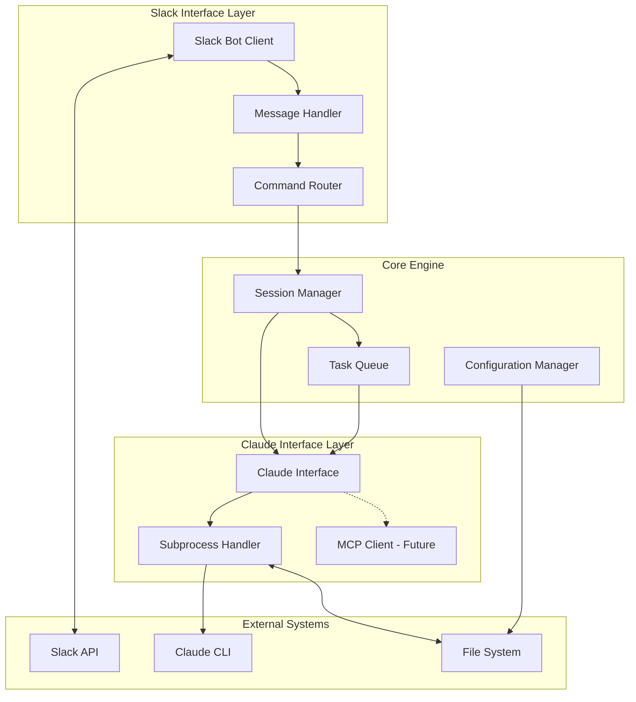

# Design Document

## Overview

The Claude Remote Client is architected as a multi-layered Python application that creates a seamless bridge between Slack and Claude CLI. The system uses an event-driven architecture with async/await patterns to handle concurrent operations across multiple Claude sessions while maintaining real-time responsiveness through Slack.

The design emphasizes modularity and evolution, starting with a subprocess-based MVP that can cleanly evolve into an MCP server. The architecture separates concerns between communication layers (Slack, Claude), session management, and command routing, enabling independent scaling and future enhancements.

## Architecture

### High-Level Architecture



### Component Architecture

The system is built around five core components that work together to provide seamless Claude access through Slack:

1. **Slack Interface Layer**: Handles all Slack communication and user interaction
2. **Core Engine**: Manages sessions, tasks, and system configuration
3. **Claude Interface Layer**: Abstracts Claude communication (subprocess now, MCP future)
4. **Command Processing**: Routes and processes user commands and Claude responses
5. **State Management**: Maintains session state and conversation history

## Components and Interfaces

### 1. Slack Interface Layer

**SlackBotClient**
- Manages WebSocket connection to Slack
- Handles authentication and reconnection logic
- Provides async message sending/receiving interface

```python
class SlackBotClient:
    async def connect(self) -> None
    async def send_message(self, channel: str, message: str) -> None
    async def listen_for_messages(self) -> AsyncIterator[SlackMessage]
    async def send_typing_indicator(self, channel: str) -> None
```

**MessageHandler**
- Processes incoming Slack messages
- Handles message formatting and threading
- Manages real-time response streaming

```python
class MessageHandler:
    async def handle_message(self, message: SlackMessage) -> None
    async def stream_response(self, channel: str, response_stream: AsyncIterator[str]) -> None
    def format_code_block(self, code: str, language: str = None) -> str
```

**CommandRouter**
- Routes `@@` commands to appropriate handlers
- Distinguishes between client commands and Claude messages
- Provides command validation and help
- Handles cron scheduling and queue management commands

```python
class CommandRouter:
    async def route_message(self, message: str, session_id: str) -> CommandResult
    def is_client_command(self, message: str) -> bool
    async def execute_client_command(self, command: str, args: List[str]) -> str
    async def handle_cron_command(self, pattern: str, tasks: List[str]) -> str
    async def handle_queue_commands(self, action: str, args: List[str]) -> str
```

### 2. Core Engine

**SessionManager**
- Manages multiple concurrent Claude sessions
- Handles session creation, switching, and cleanup
- Maintains session state and context

```python
class SessionManager:
    async def create_session(self, project_path: str, session_id: str) -> ClaudeSession
    async def switch_session(self, session_id: str) -> ClaudeSession
    async def get_active_session(self) -> ClaudeSession
    async def list_sessions(self) -> List[SessionInfo]
    async def cleanup_session(self, session_id: str) -> None
```

**TaskQueue**
- Manages automated maintenance tasks and user-defined queues
- Executes tasks during idle periods or on-demand
- Provides cron-based scheduling for recurring tasks
- Supports iterative queue processing with smart continuation

```python
class TaskQueue:
    async def add_task(self, task: MaintenanceTask) -> str
    async def add_to_queue(self, queue_name: str, task_description: str) -> str
    async def process_queue(self, queue_name: str) -> AsyncIterator[TaskResult]
    async def process_pending_tasks(self) -> None
    async def get_queue_status(self, queue_name: str = None) -> QueueStatus
    async def setup_cron_schedule(self, pattern: str, tasks: List[str]) -> None
    async def execute_cron_tasks(self) -> None
```

**ConfigurationManager**
- Handles system configuration and project setup
- Validates Claude CLI availability
- Manages Slack credentials and project paths

```python
class ConfigurationManager:
    def load_config(self) -> Config
    def validate_claude_cli(self) -> bool
    def get_project_paths(self) -> List[str]
    async def setup_initial_config(self) -> None
```

### 3. Claude Interface Layer

**ClaudeInterface** (Abstract Base)
- Defines the interface for Claude communication
- Enables switching between subprocess and MCP implementations
- Handles command execution and response streaming

```python
class ClaudeInterface(ABC):
    @abstractmethod
    async def start_session(self, project_path: str) -> None
    @abstractmethod
    async def send_message(self, message: str) -> AsyncIterator[str]
    @abstractmethod
    async def execute_slash_command(self, command: str) -> str
    @abstractmethod
    async def terminate_session(self) -> None
```

**SubprocessClaudeHandler** (MVP Implementation)
- Manages Claude CLI subprocess with `--dangerously-skip-permissions` flag
- Handles stdin/stdout communication for full file system access
- Processes interactive prompts and confirmations
- Maintains working directory context for each project

```python
class SubprocessClaudeHandler(ClaudeInterface):
    async def start_claude_process(self, project_path: str) -> None:
        # Starts: claude --dangerously-skip-permissions
        # Working directory: project_path
    async def write_to_claude(self, message: str) -> None
    async def read_from_claude(self) -> AsyncIterator[str]
    async def handle_interactive_prompt(self, prompt: str) -> str
```

**MCPClaudeHandler** (Future Implementation)
- Implements MCP protocol for native Claude integration
- Provides enhanced capabilities and performance
- Maintains backward compatibility with subprocess interface

### 4. Data Models

**ClaudeSession**
- Represents an active Claude session
- Maintains conversation history and project context
- Handles session state persistence

```python
@dataclass
class ClaudeSession:
    session_id: str
    project_path: str
    created_at: datetime
    last_activity: datetime
    conversation_history: List[Message]
    claude_process: Optional[Process]
    is_active: bool
```

**MaintenanceTask**
- Represents queued maintenance operations
- Includes task metadata and execution parameters
- Supports different task types (cleanup, review, etc.)

```python
@dataclass
class MaintenanceTask:
    task_id: str
    task_type: TaskType
    project_path: str
    command: str
    scheduled_at: datetime
    priority: int
    status: TaskStatus

@dataclass
class QueuedTask:
    queue_name: str
    task_id: str
    description: str
    project_path: str
    created_at: datetime
    status: TaskStatus
    result: Optional[str] = None

@dataclass
class CronSchedule:
    pattern: str  # e.g., "0 */2 * * *" (every 2 hours)
    tasks: List[str]  # Pre-configured task names
    project_path: str
    last_run: Optional[datetime] = None
    next_run: Optional[datetime] = None
```

## Error Handling

### Error Categories and Strategies

**1. Slack Connection Errors**
- Automatic reconnection with exponential backoff
- Message queuing during disconnection
- User notification of connection status

**2. Claude CLI Errors**
- Process crash detection and restart
- Command validation before execution
- Graceful error reporting to Slack

**3. Session Management Errors**
- Session state recovery mechanisms
- Cleanup of orphaned processes
- Clear error messages for invalid operations

**4. Configuration Errors**
- Validation at startup with clear guidance
- Fallback to default configurations where possible
- Interactive setup for missing configuration

### Error Handling Implementation

```python
class ErrorHandler:
    async def handle_slack_error(self, error: SlackError) -> None
    async def handle_claude_error(self, error: ClaudeError) -> None
    async def handle_session_error(self, error: SessionError) -> None
    def format_error_for_user(self, error: Exception) -> str
```

## Testing Strategy

### Unit Testing
- Mock Slack API interactions for isolated testing
- Subprocess mocking for Claude CLI testing
- Configuration and session management testing
- Command routing and validation testing

### Integration Testing
- End-to-end Slack bot functionality
- Claude CLI integration with real processes
- Multi-session management scenarios
- Task queue processing and error handling

### Performance Testing
- Concurrent session handling capacity
- Message throughput and latency testing
- Memory usage with multiple active sessions
- Long-running session stability

### Test Implementation Structure

```python
# Unit Tests
class TestSlackBotClient(unittest.TestCase)
class TestSessionManager(unittest.TestCase)
class TestCommandRouter(unittest.TestCase)
class TestClaudeInterface(unittest.TestCase)

# Integration Tests
class TestEndToEndWorkflow(unittest.TestCase)
class TestMultiSessionScenarios(unittest.TestCase)
class TestErrorRecovery(unittest.TestCase)

# Performance Tests
class TestConcurrentSessions(unittest.TestCase)
class TestMessageThroughput(unittest.TestCase)
```

## Deployment and Configuration

### Installation and Setup
1. **Package Installation**: `pip install claude-remote-client`
2. **Initial Configuration**: Interactive setup for Slack tokens and project paths
3. **Claude CLI Validation**: Automatic detection and validation of Claude CLI
4. **Service Startup**: Background service or manual execution modes

### Configuration Files
- **Main Config**: `~/.claude-remote-client/config.yaml`
- **Project Mapping**: `~/.claude-remote-client/projects.yaml`
- **Slack Credentials**: Environment variables or secure config file

### Runtime Requirements
- Python 3.9+
- Claude CLI installed and accessible in PATH
- Slack Bot Token with appropriate permissions (chat:write, channels:read, etc.)
- Network access to Slack API
- File system permissions for Claude to access project directories

### Claude CLI Integration Details
- **Command**: `claude --dangerously-skip-permissions`
- **Working Directory**: Set to the active project path for each session
- **Permissions**: Full file system access for development operations
- **Interactive Mode**: Maintains Claude's native interactive terminal experience
- **Session Isolation**: Each project gets its own Claude process instance

This design provides a solid foundation for the MVP while maintaining the flexibility to evolve into a more sophisticated MCP-based architecture. The modular design ensures that individual components can be enhanced or replaced without affecting the overall system stability.
## Sma
rt Queue and Cron System

### Cron-Based Automation

The system supports intelligent cron scheduling for recurring development tasks:

**@@cron Command Structure:**
```
@@cron "0 */2 * * *" clean_code,run_tests,code_review
```

**Pre-configured Tasks:**
- `clean_code`: Automated code formatting and cleanup
- `run_tests`: Execute test suites and report results
- `code_review`: AI-powered code quality analysis
- `update_deps`: Check and update dependencies
- `security_scan`: Run security vulnerability checks
- `performance_check`: Analyze performance metrics
- `documentation_update`: Update README and docs

**Cron Implementation:**
```python
class CronManager:
    async def parse_cron_pattern(self, pattern: str) -> CronSchedule
    async def schedule_tasks(self, schedule: CronSchedule) -> None
    async def execute_scheduled_tasks(self) -> None
    def get_next_run_time(self, pattern: str) -> datetime
    async def list_active_schedules(self) -> List[CronSchedule]
```

### Smart Queue System

**Queue Commands:**
- `@@queue_add <queue_name> <task_description>`: Add task to named queue
- `@@queue <queue_name>`: Process entire queue iteratively
- `@@queue_status [queue_name]`: Show queue status and progress
- `@@queue_clear <queue_name>`: Clear specific queue

**Queue Processing Logic:**
1. **Iterative Execution**: Process tasks one by one with Claude
2. **Context Preservation**: Maintain context between queue items
3. **Smart Continuation**: Handle failures and resume processing
4. **Progress Reporting**: Real-time updates via Slack

**Example Usage:**
```
@@queue_add feature_dev "Implement user authentication"
@@queue_add feature_dev "Add password validation"
@@queue_add feature_dev "Create login tests"
@@queue_add feature_dev "Update documentation"
@@queue feature_dev
```

**Queue Implementation:**
```python
class QueueManager:
    async def create_queue(self, name: str) -> None
    async def add_to_queue(self, queue_name: str, description: str) -> str
    async def process_queue_iteratively(self, queue_name: str) -> AsyncIterator[TaskResult]
    async def get_queue_progress(self, queue_name: str) -> QueueProgress
    async def pause_queue(self, queue_name: str) -> None
    async def resume_queue(self, queue_name: str) -> None
```

### Integration with Claude Sessions

**Smart Context Management:**
- Queue tasks maintain project context across iterations
- Cron tasks execute in appropriate project directories
- Results are accumulated and reported comprehensively
- Failed tasks can be retried with enhanced context

**Notification Strategy:**
- Real-time progress updates during queue processing
- Cron task completion summaries
- Error notifications with suggested remediation
- Daily/weekly automation reports