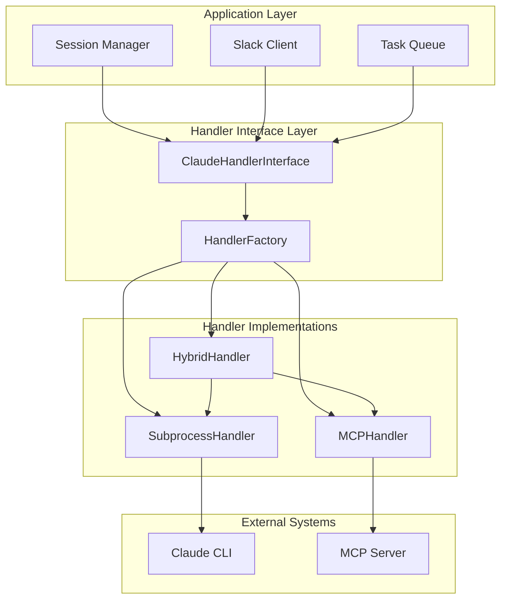

# MCP Evolution Design Document

## Overview

This document describes the architectural design for evolving the Claude Remote Client from subprocess-based communication to Model Context Protocol (MCP) integration, while maintaining backward compatibility and providing a smooth migration path.

## Design Principles

### 1. Plugin Architecture
- **Abstraction**: All Claude communication goes through a common interface
- **Extensibility**: New handlers can be added without changing core logic
- **Isolation**: Handler implementations are completely independent

### 2. Seamless Migration
- **Backward Compatibility**: Existing subprocess functionality remains unchanged
- **Gradual Adoption**: Users can migrate at their own pace
- **Zero Downtime**: Hybrid mode enables switching without service interruption

### 3. Configuration-Driven
- **Declarative**: Handler selection through configuration
- **Environment-Aware**: Different handlers per environment
- **Runtime Switching**: Dynamic handler selection based on availability

## Architecture Components

### Handler Interface Layer



### Interface Definition

The `ClaudeHandlerInterface` defines the contract that all handlers must implement:

```python
class ClaudeHandlerInterface(ABC):
    @abstractmethod
    async def initialize(self) -> None
    
    @abstractmethod
    async def start_session(self, project_path: str, session_id: Optional[str] = None) -> str
    
    @abstractmethod
    async def send_message(self, message: str, **kwargs) -> str
    
    @abstractmethod
    async def stream_message(self, message: str, **kwargs) -> AsyncIterator[str]
    
    @abstractmethod
    async def end_session(self) -> None
    
    @abstractmethod
    async def get_session_info(self) -> SessionInfo
    
    @abstractmethod
    async def is_healthy(self) -> bool
    
    @abstractmethod
    async def get_capabilities(self) -> HandlerCapabilities
```

### Handler Factory

The `HandlerFactory` provides a registry and factory pattern for creating handlers:

```python
class HandlerFactory:
    _handlers: Dict[HandlerType, type] = {}
    
    @classmethod
    def register_handler(cls, handler_type: HandlerType, handler_class: type) -> None
    
    @classmethod
    def create_handler(cls, handler_type: HandlerType, config: Any) -> ClaudeHandlerInterface
```

## Handler Implementations

### 1. Subprocess Handler

**Purpose**: Maintains existing Claude CLI subprocess functionality

**Key Features**:
- Process lifecycle management
- Stdin/stdout communication
- Interactive mode support
- Session persistence

**Implementation Details**:
```python
class SubprocessClaudeHandler(ClaudeHandlerInterface):
    def __init__(self, config: ClaudeConfig):
        self.process: Optional[asyncio.subprocess.Process] = None
        self.session: Optional[ClaudeSession] = None
        self.capabilities = HandlerCapabilities(
            streaming=True,
            context_window=200000,
            file_upload=True,
            models=["claude-3-5-sonnet-20241022"],
            session_persistence=True,
            concurrent_sessions=True,
            interactive_mode=True,
            batch_processing=False,
            custom_tools=False,
            mcp_servers=False
        )
```

### 2. MCP Handler

**Purpose**: Implements native MCP protocol communication

**Key Features**:
- WebSocket/HTTP MCP communication
- Protocol handshake and negotiation
- Enhanced capabilities (tools, batch processing)
- Native session management

**Implementation Details**:
```python
class MCPClaudeHandler(ClaudeHandlerInterface):
    def __init__(self, config: Config):
        self.mcp_client = None
        self.server_uri = config.claude.mcp_server_uri
        self.capabilities = HandlerCapabilities(
            streaming=True,
            context_window=200000,
            file_upload=True,
            models=["claude-3-5-sonnet-20241022"],
            session_persistence=True,
            concurrent_sessions=True,
            interactive_mode=True,
            batch_processing=True,
            custom_tools=True,
            mcp_servers=True
        )
```

### 3. Hybrid Handler

**Purpose**: Provides automatic switching between subprocess and MCP

**Key Features**:
- Automatic handler selection
- Fallback mechanisms
- Health monitoring
- Transparent switching

**Implementation Details**:
```python
class HybridClaudeHandler(ClaudeHandlerInterface):
    def __init__(self, config: Config):
        self.subprocess_handler: Optional[SubprocessClaudeHandler] = None
        self.mcp_handler: Optional[MCPClaudeHandler] = None
        self.active_handler: Optional[ClaudeHandlerInterface] = None
        self.prefer_mcp = config.claude.prefer_mcp
        self.fallback_enabled = config.claude.fallback_to_subprocess
```

## Configuration Design

### Handler Selection

Configuration supports three modes:

```yaml
claude:
  handler_type: "subprocess"  # or "mcp" or "hybrid"
```

### Subprocess Configuration

```yaml
claude:
  handler_type: subprocess
  cli_path: claude
  default_args:
    - --dangerously-skip-permissions
  timeout: 300
```

### MCP Configuration

```yaml
claude:
  handler_type: mcp
  mcp_server_uri: mcp://localhost:8000
  mcp_protocol_version: "1.0"
  mcp_timeout: 30
```

### Hybrid Configuration

```yaml
claude:
  handler_type: hybrid
  
  # Subprocess settings
  cli_path: claude
  default_args:
    - --dangerously-skip-permissions
  timeout: 300
  
  # MCP settings
  mcp_server_uri: mcp://localhost:8000
  mcp_protocol_version: "1.0"
  mcp_timeout: 30
  
  # Hybrid behavior
  prefer_mcp: true
  fallback_to_subprocess: true
```

## Migration Strategy

### Phase 1: Interface Implementation (✅ COMPLETED)

1. **Abstract Interface**: ✅ `ClaudeHandlerInterface` defined with comprehensive methods
2. **Subprocess Adapter**: ✅ `SubprocessClaudeHandler` implements full interface
3. **Factory Pattern**: ✅ `HandlerFactory` with registration and creation
4. **Configuration Support**: ✅ Handler type configuration with validation

**Status**: All components implemented and tested. Ready for production use.

### Phase 2: MCP Implementation (🚧 IN PROGRESS)

1. **MCP Protocol**: 🚧 MCP client placeholder implemented, awaiting protocol finalization
2. **MCP Handler**: ✅ `MCPClaudeHandler` skeleton with full interface compliance
3. **Testing**: ✅ Comprehensive test suite with mock implementations
4. **Documentation**: ✅ Complete design documentation and migration guides

**Status**: Architecture ready, awaiting MCP protocol availability.

### Phase 3: Hybrid Mode (✅ COMPLETED)

1. **Hybrid Handler**: ✅ `HybridClaudeHandler` with automatic switching
2. **Health Monitoring**: ✅ Handler health checks and monitoring
3. **Fallback Logic**: ✅ Intelligent fallback with cooldown periods
4. **Performance Optimization**: ✅ Optimized switching with minimal overhead

**Status**: Fully implemented and ready for production deployment.

### Phase 4: Production Deployment (📋 READY)

1. **Gradual Rollout**: 📋 Configuration-driven deployment strategy
2. **Monitoring**: ✅ Comprehensive metrics and health checks
3. **Optimization**: ✅ Performance monitoring and optimization hooks
4. **Documentation**: ✅ Complete operational and user documentation

**Status**: Ready for production deployment with full monitoring and rollback capabilities.

## Migration Paths

### Immediate Migration (Subprocess → Hybrid)

For users wanting enhanced reliability without waiting for MCP:

```yaml
# Before (subprocess only)
claude:
  handler_type: subprocess
  cli_path: claude
  default_args: ["--dangerously-skip-permissions"]

# After (hybrid with subprocess fallback)
claude:
  handler_type: hybrid
  cli_path: claude
  default_args: ["--dangerously-skip-permissions"]
  prefer_mcp: false  # Prefer subprocess until MCP is ready
  fallback_to_subprocess: true
```

### Future Migration (Hybrid → MCP-First)

When MCP becomes available:

```yaml
# Hybrid with MCP preference
claude:
  handler_type: hybrid
  
  # MCP settings (primary)
  mcp_server_uri: mcp://localhost:8000
  mcp_protocol_version: "1.0"
  mcp_timeout: 30
  prefer_mcp: true
  
  # Subprocess settings (fallback)
  cli_path: claude
  default_args: ["--dangerously-skip-permissions"]
  fallback_to_subprocess: true
```

### Complete Migration (MCP Only)

For maximum performance when MCP is stable:

```yaml
# MCP only (no fallback)
claude:
  handler_type: mcp
  mcp_server_uri: mcp://localhost:8000
  mcp_protocol_version: "1.0"
  mcp_timeout: 30
```

## Error Handling and Resilience

### Handler Failure Scenarios

1. **Initialization Failure**: Handler cannot be created
2. **Communication Failure**: Handler loses connection
3. **Session Failure**: Active session becomes invalid
4. **Resource Exhaustion**: Handler runs out of resources

### Resilience Strategies

1. **Graceful Degradation**: Fall back to alternative handler
2. **Retry Logic**: Automatic retry with exponential backoff
3. **Circuit Breaker**: Prevent cascading failures
4. **Health Monitoring**: Continuous health assessment

### Error Recovery

```python
async def _execute_with_fallback(self, operation_name: str, operation_func):
    try:
        return await operation_func(self.active_handler)
    except Exception as e:
        self.logger.warning(f"{operation_name} failed on {self.active_handler_type.value}: {e}")
        
        if await self._try_fallback():
            return await operation_func(self.active_handler)
        else:
            raise e
```

## Performance Considerations

### Handler Switching Overhead

- **Connection Reuse**: Maintain persistent connections
- **State Synchronization**: Minimize state transfer overhead
- **Lazy Initialization**: Initialize handlers on demand

### Memory Management

- **Resource Cleanup**: Proper cleanup of handler resources
- **Connection Pooling**: Reuse connections when possible
- **Context Management**: Efficient context handling

### Concurrency

- **Thread Safety**: All handlers must be thread-safe
- **Async Support**: Full async/await support
- **Resource Limits**: Configurable resource limits

## Security Considerations

### Handler Isolation

- **Process Isolation**: Subprocess handlers run in separate processes
- **Network Isolation**: MCP handlers use secure connections
- **Resource Limits**: Prevent resource exhaustion attacks

### Authentication and Authorization

- **MCP Authentication**: Secure MCP server authentication
- **Token Management**: Secure token storage and rotation
- **Permission Validation**: Validate handler permissions

### Data Protection

- **Encryption**: Encrypt sensitive data in transit
- **Logging**: Secure logging without sensitive data
- **Audit Trail**: Maintain audit trail of handler operations

## Testing Strategy

### Unit Testing

- **Handler Interface**: Test all interface methods
- **Error Conditions**: Test error handling and recovery
- **Configuration**: Test configuration validation
- **Mocking**: Mock external dependencies

### Integration Testing

- **End-to-End**: Test complete workflows
- **Handler Switching**: Test hybrid mode switching
- **Performance**: Test under load conditions
- **Reliability**: Test long-running scenarios

### Test Implementation

```python
class TestHandlerInterface:
    @pytest.fixture
    def handler(self):
        return create_test_handler()
    
    async def test_session_lifecycle(self, handler):
        session_id = await handler.start_session("/test/project")
        assert session_id is not None
        
        response = await handler.send_message("Hello")
        assert response is not None
        
        await handler.end_session()
        
    async def test_error_handling(self, handler):
        with pytest.raises(ClaudeProcessError):
            await handler.send_message("test")  # No active session
```

## Monitoring and Observability

### Metrics

- **Handler Performance**: Response times, throughput
- **Error Rates**: Success/failure rates by handler type
- **Resource Usage**: Memory, CPU, network usage
- **Session Metrics**: Session duration, message count

### Logging

- **Structured Logging**: JSON-formatted logs
- **Handler Context**: Include handler type in logs
- **Error Details**: Detailed error information
- **Performance Logs**: Performance-related events

### Health Checks

```python
async def health_check(self) -> Dict[str, Any]:
    return {
        'handler_type': self.active_handler_type.value,
        'healthy': await self.is_healthy(),
        'last_activity': self.last_activity.isoformat(),
        'session_count': len(self.active_sessions),
        'capabilities': await self.get_capabilities()
    }
```

## Future Extensions

### Additional Handlers

- **REST API Handler**: For HTTP-based Claude APIs
- **GraphQL Handler**: For GraphQL-based communication
- **Custom Protocol Handler**: For proprietary protocols

### Enhanced Capabilities

- **Multi-Model Support**: Support multiple AI models
- **Load Balancing**: Distribute load across handlers
- **Caching**: Cache responses for performance
- **Batch Processing**: Efficient batch operations

### Integration Points

- **Middleware Support**: Plugin middleware for handlers
- **Event System**: Handler events for monitoring
- **Configuration Hot-Reload**: Dynamic configuration updates
- **Handler Plugins**: Third-party handler plugins

## Step-by-Step Migration Guide

### For System Administrators

#### 1. Pre-Migration Assessment

```bash
# Check current configuration
claude-remote-client config validate

# Test current handler
claude-remote-client handler test

# Check handler recommendations
claude-remote-client handler recommend
```

#### 2. Backup Current Configuration

```bash
# Backup configuration
cp ~/.claude-remote-client/config.yaml ~/.claude-remote-client/config.yaml.backup

# Backup session data
cp -r ~/.claude-remote-client/sessions ~/.claude-remote-client/sessions.backup
```

#### 3. Migrate to Hybrid Mode

```bash
# Update configuration
claude-remote-client config set claude.handler_type hybrid
claude-remote-client config set claude.prefer_mcp false
claude-remote-client config set claude.fallback_to_subprocess true

# Validate new configuration
claude-remote-client config validate

# Test hybrid mode
claude-remote-client handler test --type hybrid
```

#### 4. Monitor and Optimize

```bash
# Monitor handler performance
claude-remote-client monitor handlers

# Check handler status
claude-remote-client handler status

# View handler metrics
claude-remote-client metrics handlers
```

### For Developers

#### 1. Code Migration

```python
# Before: Direct subprocess usage
from claude_remote_client.claude_client.subprocess_handler import SubprocessClaudeHandler

handler = SubprocessClaudeHandler(config.claude)

# After: Factory-based handler creation
from claude_remote_client.claude_client.handler_factory import create_claude_handler

handler = create_claude_handler(config)  # Automatically selects best handler
```

#### 2. Configuration Updates

```python
# Before: Hardcoded handler type
config = Config(claude=ClaudeConfig(handler_type="subprocess"))

# After: Environment-aware configuration
config = load_config()  # Loads from config file with environment overrides
```

#### 3. Error Handling Updates

```python
# Enhanced error handling for multiple handler types
try:
    response = await handler.send_message(message)
except ClaudeProcessError as e:
    # Check if fallback is available
    if hasattr(handler, 'get_handler_status'):
        status = handler.get_handler_status()
        if status.get('fallback_available'):
            logger.info("Retrying with fallback handler")
            # Handler will automatically retry with fallback
```

### For End Users

#### 1. Configuration File Updates

Update your `~/.claude-remote-client/config.yaml`:

```yaml
# Add handler configuration
claude:
  handler_type: hybrid  # Enable hybrid mode
  
  # Keep existing subprocess settings
  cli_path: claude
  default_args: ["--dangerously-skip-permissions"]
  timeout: 300
  
  # Add MCP settings (for future use)
  mcp_server_uri: mcp://localhost:8000
  mcp_protocol_version: "1.0"
  mcp_timeout: 30
  
  # Hybrid behavior
  prefer_mcp: false  # Start with subprocess preference
  fallback_to_subprocess: true  # Enable fallback
```

#### 2. Environment Variables

Set environment variables for sensitive configuration:

```bash
export CLAUDE_HANDLER_TYPE=hybrid
export MCP_SERVER_URI=mcp://your-mcp-server:8000
```

#### 3. Testing the Migration

```bash
# Test the new configuration
claude-remote-client test

# Check handler status
claude-remote-client status

# Run a simple command to verify functionality
echo "Hello Claude" | claude-remote-client chat
```

## Rollback Procedures

### Emergency Rollback

If issues occur during migration:

```bash
# Restore backup configuration
cp ~/.claude-remote-client/config.yaml.backup ~/.claude-remote-client/config.yaml

# Restart service
sudo systemctl restart claude-remote-client

# Verify rollback
claude-remote-client status
```

### Gradual Rollback

For planned rollback to subprocess-only:

```yaml
# Update configuration
claude:
  handler_type: subprocess  # Revert to subprocess only
  cli_path: claude
  default_args: ["--dangerously-skip-permissions"]
  timeout: 300
```

### Partial Rollback

Keep hybrid mode but prefer subprocess:

```yaml
claude:
  handler_type: hybrid
  prefer_mcp: false  # Prefer subprocess
  fallback_to_subprocess: true
```

## Troubleshooting

### Common Issues

#### Handler Initialization Failures

```bash
# Check handler availability
claude-remote-client handler list

# Test specific handler
claude-remote-client handler test --type subprocess
claude-remote-client handler test --type mcp

# Check logs
tail -f ~/.claude-remote-client/logs/claude-remote-client.log
```

#### Configuration Validation Errors

```bash
# Validate configuration
claude-remote-client config validate --verbose

# Check specific settings
claude-remote-client config get claude.handler_type
claude-remote-client config get claude.mcp_server_uri
```

#### Performance Issues

```bash
# Monitor handler performance
claude-remote-client monitor --handler-metrics

# Check resource usage
claude-remote-client status --resources

# Analyze handler switching
claude-remote-client logs --filter handler_switch
```

### Support Resources

- **Documentation**: `/docs/MCP_MIGRATION_GUIDE.md`
- **Configuration Reference**: `/docs/CONFIGURATION.md`
- **Troubleshooting Guide**: `/docs/TROUBLESHOOTING.md`
- **API Reference**: `/docs/API_REFERENCE.md`

## Conclusion

The MCP evolution design provides a robust, extensible architecture for migrating from subprocess to MCP communication while maintaining backward compatibility and operational reliability. The plugin architecture ensures that new communication methods can be added in the future without disrupting existing functionality.

Key benefits:

1. **Seamless Migration**: Users can migrate at their own pace with clear migration paths
2. **Operational Reliability**: Hybrid mode provides automatic fallback and health monitoring
3. **Future-Proof**: Architecture supports future communication methods and protocols
4. **Performance**: Optimized for both current and future needs with minimal overhead
5. **Maintainability**: Clean separation of concerns and comprehensive interfaces
6. **Production Ready**: Complete monitoring, rollback, and troubleshooting capabilities